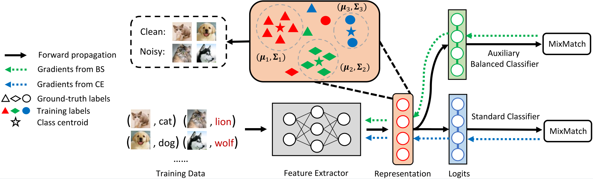

# [IJCAI'23] Stochastic Feature Averaging for Learning with Long-Tailed Noisy Labels
PyTorch Code for the following paper at IJCAI2023

<b>Title</b>: <i>Stochastic Feature Averaging for Learning with Long-Tailed Noisy Labels</i>

<b>Abstract</b>
Deep neural networks have shown promising results on a wide variety of tasks using large-scale and well-annotated training datasets. However, data collected from real-world applications can suffer from two prevalent biases, i.e., long-tailed class distribution and label noise. Previous efforts on long-tailed learning and label-noise learning can only address a single type of data bias, leading to a severe deterioration of their performance. In this paper, we propose a distance-based sample selection algorithm called Stochastic Feature Averaging (SFA), which fits a Gaussian using the exponential running average of class centroids to capture uncertainty in representation space due to label noise and data scarcity. With SFA, we detect noisy samples based on their distances to class centroids sampled from this Gaussian distribution. Based on the identified clean samples, we then propose to train an auxiliary balanced classifier to improve the generalization for the minority class and facilitate the update of Gaussian parameters. Extensive experimental results show that SFA can enhance the performance of existing methods on both simulated and real-world datasets. Further, we propose to combine SFA with the sample-selection approach, distribution-robust, and noise-robust loss functions, resulting in significant improvement over the baselines.

<b>Illustration</b>


<b>Environment</b>

* Python 3.7

* PyTorch 1.12.0

* numpy 1.21.6

* scikit-learn 1.2.0

<b>Experiments</b>

First, install dependencies listed in `requirements.txt`:

```sh
pip install -r requirements.txt
```

Next, run the following commands to conduct the experiment:

```sh
# Experiment on CIFAR with given label noise and class imbalance
python Train_cifar.py --noise_ratio 0.5 --imb_factor 0.01

# Experiment on WebVision dataset
python Train_webvision.py
```

<b>Acknowledgement</b>\
Thanks the following repositories for code reference:

[RoLT](https://github.com/Stomach-ache/RoLT), 

[Classifier-Balancing](https://github.com/facebookresearch/classifier-balancing), 

[DivideMix](https://github.com/LiJunnan1992/DivideMix), etc.

<!--
<b>Cite DivideMix</b>\
If you find the code useful in your research, please consider citing our paper:

<pre>
@inproceedings{
    li2023sfa,
    title={Stochastic Feature Averaging for Learning with Long-Tailed Noisy Labels},
    author={},
    booktitle={},
    year={2023},
}</pre>
-->

<b>License</b>\
This project is licensed under the terms of the MIT license.
